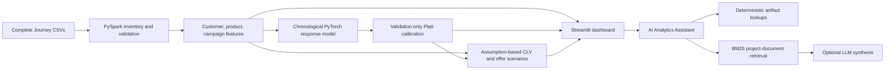

# AI Product & Customer Intelligence Platform

An end-to-end retail analytics portfolio project using the [dunnhumby Complete Journey dataset](https://www.dunnhumby.com/source-files/). PySpark builds verified customer, product, and campaign tables; PyTorch predicts observed coupon redemption; a validation-fitted calibrator and assumption-based finance layer produce decision-support outputs for a Streamlit dashboard and analytics assistant.

Campaign performance is observational and descriptive. The response model does not estimate treatment effects. CLV and offer economics are modeled scenarios under stated assumptions.

## What is implemented

* **Data engineering:** PySpark CSV inventory, schema/quality checks, scalable joins and aggregations, and Spark SQL examples.
* **Predictive modeling:** A small feed-forward PyTorch binary classifier for observed redemption among campaign-assigned household/campaign rows. Its 14 historical features use a configurable 90 `DAY`-index lookback and strict `DAY < START_DAY` cutoff.
* **Time-aware evaluation:** Campaign start-day chronological splits, training-only preprocessing and class weighting, early stopping, simple baselines, and held-out evaluation.
* **Calibration:** Platt scaling fit using validation predictions/labels, then applied to the later test period.
* **Finance:** Illustrative CLV/NPV and campaign offer scenario outputs, with the 711-index-day revenue denominator and other business assumptions stated in configuration.
* **Presentation and assistant:** Eight-section Streamlit dashboard, deterministic analytics lookups, BM25 documentation retrieval, and an optional OpenAI-compatible LLM adapter.

This is an analytics and decision-support demonstration, not a production offer optimizer, randomized experiment, or causal measurement system. See [portfolio claims and interview guidance](docs/portfolio_claims.md) for defensible descriptions and limitations.

## Results snapshot

Saved model results for the chronological test split (`START_DAY` 587–659; 2,213 assigned household/campaign observations):

| Test method | ROC-AUC | Average Precision | Accuracy | Precision | Recall | F1 |
| --- | ---: | ---: | ---: | ---: | ---: | ---: |
| Majority-class baseline | 0.500 | 0.143 | 0.857 | 0.000 | 0.000 | 0.000 |
| Prior-redemption indicator baseline | 0.702 | 0.267 | 0.791 | 0.357 | 0.577 | 0.441 |
| PyTorch model, raw probability | 0.806 | 0.431 | 0.723 | 0.304 | 0.729 | 0.429 |
| PyTorch + validation-fitted Platt scaling | 0.806 | 0.431 | 0.723* | 0.304* | 0.729* | 0.429* |

`*` The calibrated probability threshold remains fixed at 0.5; the calibration mapping preserves ranking and therefore the threshold classification results here. On test, Brier score changes from 0.204 raw to 0.117 calibrated; ECE changes from 0.308 to 0.094. The model improves ranking over the simple prior-redemption indicator, but the indicator has a slightly higher fixed-threshold F1. These results are evidence of a portfolio prototype, not proof of deployment readiness or future-period performance. Full saved metrics and split details are in `data/processed/modeling/response_model_metrics.json` and `response_model_calibration_metrics.json` after running the pipeline.

## Architecture



## Repository map

| Path | Purpose |
| --- | --- |
| `data/raw/` | Locally supplied source CSVs; ignored by Git. |
| `data/processed/` | Generated Parquet and report artifacts; ignored except the modeling-method README. |
| `src/ingestion/` | Spark inventory, CSV reading, and data-quality validation. |
| `src/features/` | Customer, product, and campaign feature transformations. |
| `src/sql/` | Spark SQL analytical examples. |
| `src/models/pytorch/` | Training-data builder, classifier, and Platt calibrator. |
| `src/finance/` | Configured NPV/CLV and offer scenario logic. |
| `src/dashboard/` | Streamlit app and validated artifact loading. |
| `src/rag/` | BM25 documentation retrieval, deterministic analytics, optional provider adapter. |
| `tests/` | Synthetic unit/logic tests; no live LLM call. |
| `configs/` | Ingestion, time-window, modeling, and finance settings. |

The `src/experimentation/`, `src/pyspark/`, and `notebooks/` directories are reserved for future work and currently contain no implemented project modules.

## Reproduce locally (macOS)

The verified local environment is Python 3.13.5, PySpark 4.2.0, and Java 17. A Dockerfile targets Python 3.11, but the end-to-end workflows and test suite were verified locally on Python 3.13.5; do not treat the Dockerfile as a tested, turnkey pipeline image.

1. Install Python 3.13 and Java 17 (for example, with Homebrew):

   ```bash
   brew install python@3.13 openjdk@17
   ```

2. Clone the repository, create an environment, install dependencies, and configure Java:

   ```bash
   git clone <repository-url>
   cd dunnhumby-ai-customer-intelligence
   python3.13 -m venv .venv
   source .venv/bin/activate
   python -m pip install --upgrade pip
   python -m pip install -r requirements.txt
   export JAVA_HOME="$(/usr/libexec/java_home -v 17)"
   export PATH="$JAVA_HOME/bin:$PATH"
   java -version
   python --version
   ```

   On Linux, install a Java 17 JDK/JRE using the distribution package manager and set `JAVA_HOME` to that installation. Spark 4.2.0 requires a compatible Java runtime; use Java 17 for this project configuration.

3. Obtain **The Complete Journey** from the [official dunnhumby source-files page](https://www.dunnhumby.com/source-files/) and follow its user-guide/license instructions. Extract the original CSVs directly into `data/raw/`, preserving filenames. This repository expects `campaign_desc.csv`, `campaign_table.csv`, `causal_data.csv`, `coupon.csv`, `coupon_redempt.csv`, `hh_demographic.csv`, `product.csv`, and `transaction_data.csv`. Do not commit the source data.

4. From the repository root, run the pipeline in order:

   ```bash
   # Inspect actual input files and write the inventory report.
   python -m src.ingestion.inspect_dataset --config configs/ingestion.yaml

   # Build the Spark customer, product, and campaign feature tables.
   python -m src.features.build_features --config configs/feature_windows.yaml

   # Build the campaign-household modeling dataset (90-day lookback by default).
   python -m src.models.pytorch.build_training_data --config configs/modeling.yaml

   # Train/evaluate the PyTorch model; this writes the model and metrics.
   python -m src.models.pytorch.train_response_model --config configs/modeling.yaml

   # Fit Platt calibration on validation only and evaluate on test.
   python -m src.models.pytorch.calibrate_response_model --config configs/modeling.yaml

   # Build CLV and held-out offer scenario tables/reports.
   python -m src.finance.build_finance --config configs/finance.yaml

   # Run tests.
   python -m pytest -q
   ```

   The inventory and full Spark builds can take time, especially on the 36.8-million-row `causal_data.csv`. Feature/model/finance artifacts are generated locally and are not committed. The model builder does not join `causal_data.csv`; the assistant and dashboard do not load it.

5. Launch the dashboard after artifacts have been built:

   ```bash
   streamlit run src/dashboard/app.py
   ```

   The eight sections are Executive Overview, Customer Explorer, Campaign Analytics, Customer Value / CLV, Offer Economics, Model Performance, Methodology & Assumptions, and AI Analytics Assistant.

The assistant works without an external provider. To enable an OpenAI-compatible Chat Completions service, configure `LLM_BASE_URL` and `LLM_MODEL` in the launch shell, plus `LLM_API_KEY` if required. Do not commit secrets. See [`src/rag/README.md`](src/rag/README.md) for scope and data sent to the endpoint.

## Method and limitations

* `DAY` and `WEEK_NO` are ordered integer indices, not calendar dates.
* The model target is at least one observed coupon redemption attributed to an assigned household/campaign within that campaign's inclusive day interval; negatives are assigned observations with no matching redemption.
* Historical model features use the configured pre-start lookback and strict `DAY < START_DAY`. Campaign assignment is not treated as randomized.
* The 711-day finance denominator is a configured dataset-span assumption, not household tenure. Margin, retention, discount rate, and offer cost are assumptions, not learned values.
* `coupon.csv` has 5,164 exact duplicate rows; package-size/category missingness and the transaction quantity upper tail are documented and not silently repaired. See [`data/README.md`](data/README.md).
* `causal_data.csv` has partial store coverage relative to transactions and is not used for the current feature/model/dashboard outputs.
* BM25 retrieval plus deterministic tools is a small retrieval-augmented assistant, not a vector-search or autonomous agent system. Optional LLM responses can still make mistakes; review their cited evidence. Quantitative values come from deterministic tools.

For data and feature definitions, see [`data/README.md`](data/README.md), [`src/features/README.md`](src/features/README.md), [`data/processed/modeling/README.md`](data/processed/modeling/README.md), and [`src/finance/README.md`](src/finance/README.md).
